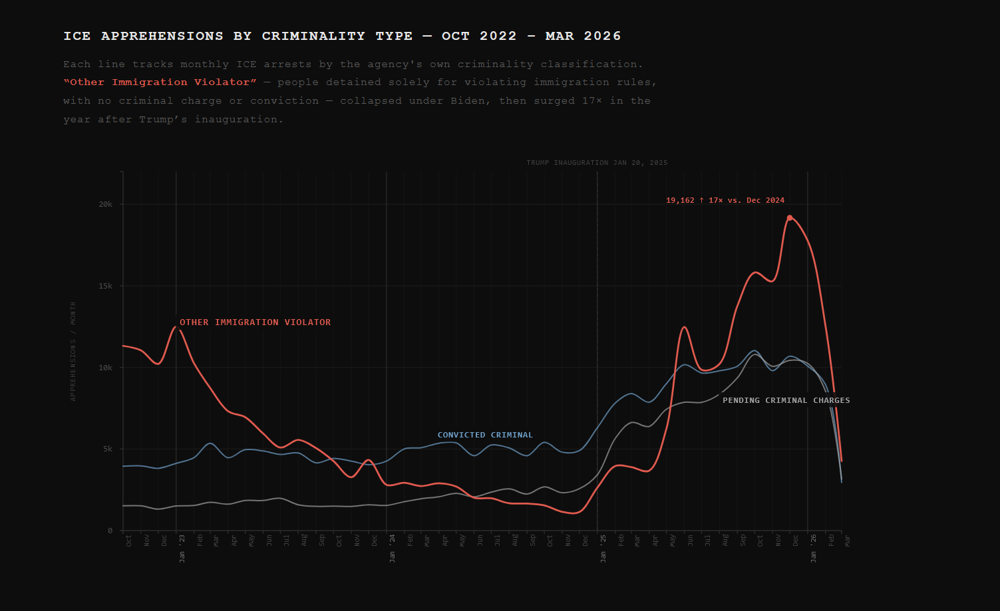
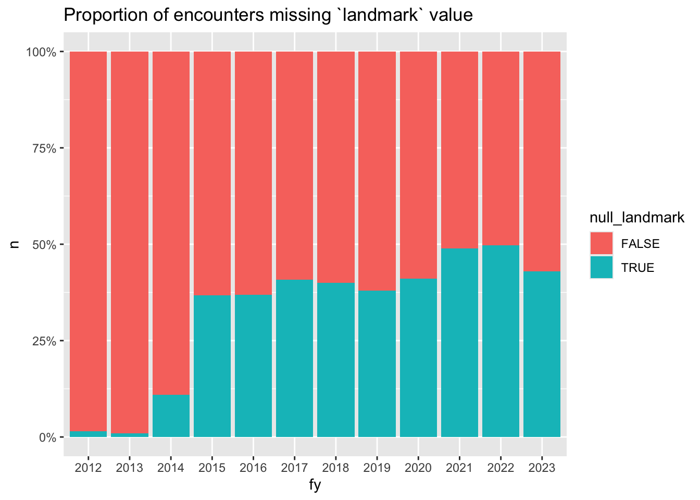
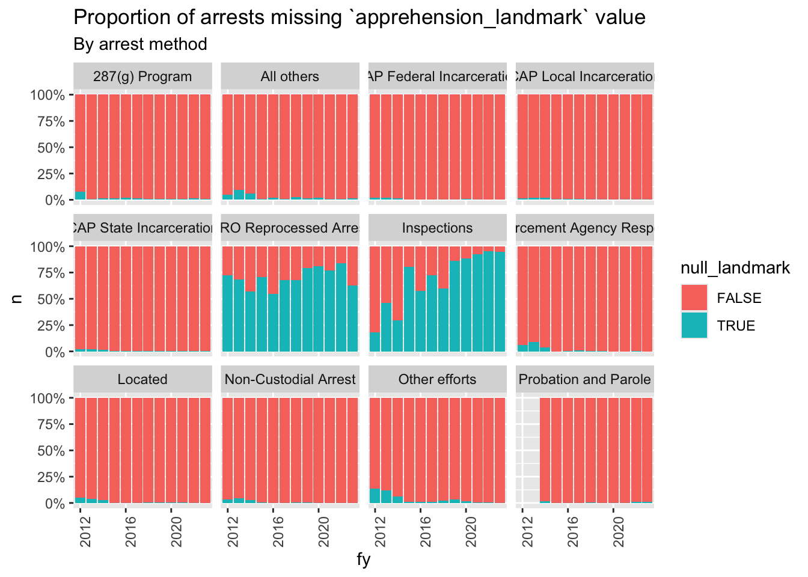
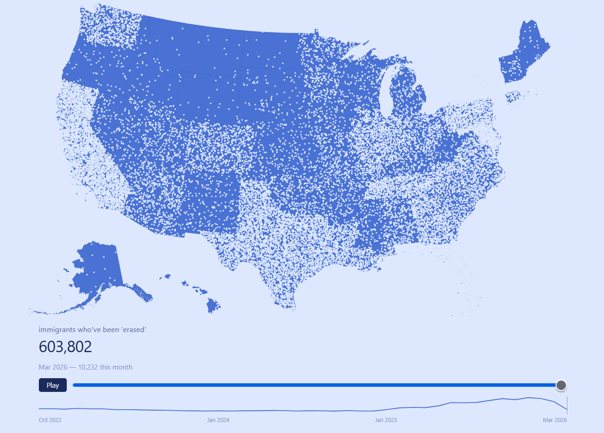
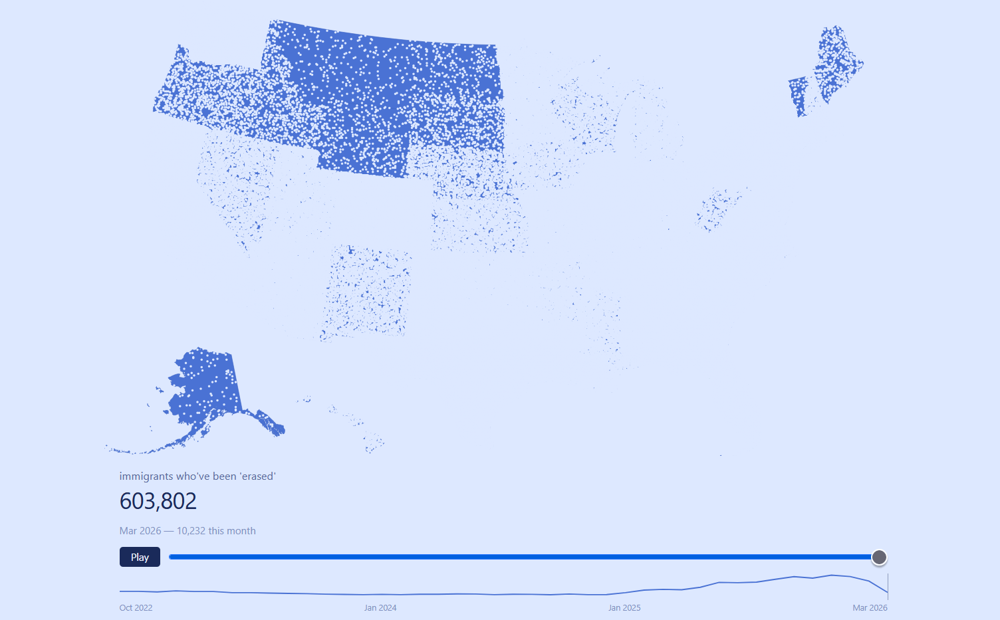

# The absence of data strings as a purposeful tactic of "permanent deletion" towards immigrants
research into the ICE database system + the purposeful absence of data to dehumanize immigrants 

# Why ?

As an artist, technologist, and activist, I wanted to unpack the 'false' complexities of the tech industry. Often, people with no knowledge in programming or technology feel like they can never fully understand this industry. It feels like "if you know, you know" situation. This false sense of academic elitism disproportionately affects the working class, immigrants, and BIPOC communities, and places programming on a pedestal for the elite. Of course, there are complexities in understanding mathematical equations and logical structures, but the very basics can be explained in simple terms. These systems can be broken down in plain language. 

In an era where we are in an 'AI' & 'tech' boom, these boundaries become harder to break through. When resources become harder to access and the wealth gap widens, accessibility to learning these systems that surveil us, control us, and have become necessities in our lives diminishes. Without fundamental knowledge of these systems, this leads to more control by the government and the wealthy. By understanding these systems, we can use this knowledge as a form of resistance and protest. This 'tech boom' is not the full future of our society. 

It often feels hopeless to think of the future when it feels like it has already been decided for you. Or what is even the point of studying or learning certain things when a machine can do it for you? As a technologist, I can understand the importance of this tech revolution for innovation, but as an artist, I'll never fully give up my autonomy, passion, and individuality to a machine. Make technology work for you, not the other way around. 

# Abstract: 
This paper examines the structural role of absent and incomplete data within the U.S. Immigration and Customs Enforcement (ICE) arrest database as a deliberate mechanism of dehumanization and institutional erasure. Drawing on publicly available records obtained through Freedom of Information Act litigation and organized by the Deportation Data Project, this study analyzes key database fields — including apprehension type, apprehension method, apprehension by criminality, and apprehension landmark — to identify patterns of missing, null, and inconsistent data entries. Through close reading of database architecture and legal terminology, this paper argues that the absence of data strings in ICE records is not incidental mismanagement but a purposeful tactic: one that obscures the scope of enforcement, limits public accountability, and furthers the systemic erasure of immigrant lives from institutional record. Situating this analysis within existing scholarship on algorithmic inequality and the surveillance of marginalized communities — particularly the work of Virginia Eubanks — this paper contends that the undercollection of data functions as a mirror image of mass surveillance, both serving as tools of governmental control over immigrant populations. The surge in immigration-only detentions since the start of the second Trump administration, combined with critical gaps in location and arrest data for those detainees, illustrates how database negligence operates alongside enforcement escalation to suppress evidence of state action. This paper ultimately argues that understanding these systems — their structures, their silences, and their language — is itself a form of resistance.

# What is a data string? Why is it relevant to immigrants detained by ICE?
A data string is a data type in the form of a sequence — either text, characters, integers, or bytes. Data strings are an integral part of creating a database structure: they are the mechanism by which information is categorized, allowing users to easily retrieve and store data. A database is, at its most basic level, a structured spreadsheet of categorized information.

The role of databases is central to understanding the dehumanization and attempted “permanent deletion” of immigrants in the United States. The core of my research involved examining how ICE organizes its database system and what information is publicly available.

This information is not readily available through ICE’s website, but can be obtained through public records litigation — a process that requires submitting a detailed request explaining why you need the information and how you intend to use it. This process is lengthy and burdensome. Fortunately, activists have fought to make this data publicly available and have built web applications to routinely update it. To keep the information current, they must continuously submit new records requests, holding this data publicly accountable.
Websites like TRAC and the Deportation Data Project organize this data in more accessible formats and allow for public access. These websites are still difficult to navigate for the average person, particularly those without a programming background. The Deportation Data Project does provide extensive documentation on how to read and interpret the data — but at the end of the day, it is a large spreadsheet filled with legal jargon that is not easily digestible.

After carefully reading through the database and researching the legal terminology, I was able to uncover the absence and lack of data that the ICE database contains, and to identify shifts in patterns and the rise of ICE activity since the start of Trump’s presidency.

# Before I explain the why, you must understand how the system works.

The Deportation Data Project separates its data into major categories such as ICE Arrests and ICE Facility Daily Populations. I will be focusing on these two major categories. When ICE detains someone, it records basic information: the date and location of arrest, the “type” and “method” of arrest, birth year, gender, country of citizenship, any criminal offense, and more. The public-facing database does not include the immigrant’s full name, images, or detailed personal information — ostensibly to protect against doxxing.
Within ICE’s arrest database, the agency deliberately employs legal and unfamiliar jargon to obscure what the data reveals and to make it difficult for the public to uncover their inhumane practices. They hide behind terminology designed to confuse.

Some of the key questions and findings were breaking down the legal jargon of certain phases, examining the data that were missing. I wanted to look into ways how ICE detained people, the approach, geographical location, why they detained the individual, and the geographical growth of ICE presence due to Trumps Presidency. 

## Key terms and their meanings:

Apprehension_type refers to whether an individual was targeted or collateral — a field introduced in the database that only became usable starting in August 2025, as the data is effectively null for all records prior to that point. A targeted arrest means ICE specifically sought out that individual; collateral indicates the person was swept up during an ICE raid without being the primary target. It is worth noting that ICE has never officially defined the term "collateral" in this context, and has disputed the accuracy of the Deportation Data Project's data without offering any alternative — a silence that itself speaks to the institutional opacity this paper examines.

Apprehension_method refers to the tactic used to detain the individual. The categories are: located, non-custodial arrest, custodial arrest, 287(g) program, and border patrol. These are two distinct but related categories: located and non-custodial arrest are each separate designations, though researchers often combine them because both are more likely to indicate individuals arrested from their communities — their homes, workplaces, or public spaces. Custodial arrest, the 287(g) program, and border patrol, by contrast, tend to indicate detention originating from a state or local jail, prison, or federal facility.

Apprehension_by_criminality refers to the reason a person was detained: did they have an actual criminal charge, or were they detained solely for violating their immigration status? There has been a sharp and documented surge in detainees held for immigration status violations alone, particularly since the start of Trump's second term. As of April 2026, over 70% of people held in ICE detention had no criminal conviction of any kind. This distinction is critical — but it requires precision. Unlawful presence (overstaying a visa, remaining after an order to leave, violating the terms of a legal entry) is a civil violation, not a criminal offense — comparable in legal weight to a traffic infraction. Unlawful entry, meaning crossing the border without documentation, is technically a misdemeanor on the first offense and a felony on repeat offenses. Depending on which charge applies, these individuals may not have committed a crime in any meaningful sense — and the data shows they are now the majority of people in ICE custody.

Apprehension_landmark is supposed to indicate where a detainee was originally apprehended. However, this field is documented as being used inconsistently across records — sometimes containing the name of a police department, sheriff's office, or local jail, but more often absent entirely. My analysis found this gap to be especially pronounced for individuals whose only offense was an immigration violation. The location of their detainment, in many cases, simply does not exist in the record. This is where the absence of data becomes most visible — and, this paper argues, most deliberate.

University of Washington Center for Human Rights (UWCHR), "Proportion of encounters missing landmark value," figure from "ICE ERO-LESA Enforcement Events FY12–22: Analysis of 'Landmark' Fields," October 31, 2024, https://uwchr.github.io/ice-enforce/landmarks.html.

University of Washington Center for Human Rights (UWCHR), "Proportion of arrests missing apprehension_landmark value, by arrest method," figure from "ICE ERO-LESA Enforcement Events FY12–22: Analysis of 'Landmark' Fields," October 31, 2024, https://uwchr.github.io/ice-enforce/landmarks.html.

Here are two charts 1 visualizing the grief and overwhelming amount of people wrongfully detained by ICE, showcasing the permanent absence of their existence in the US, by visually erasing the US by each indiviual taken
2 chat visualizing the absence of data on a graph to show the intentional gaps in the data. how this negligence and mismanagement is purposeful

# The Intentional Absence of Data

Some may argue that this is simply the result of mismanagement: large organizations have data backlogs, systems fail, errors accumulate. While that is partially true, under any large organization, persistent negligence and mismanagement reveals a lack of care — and functions as a way to control the narrative. This is especially significant in an era when the tools for mass surveillance are readily available and actively used. ICE itself uses surveillance technology to monitor immigrants, including SmartLink check-ins, ankle monitors, and other tracking methods. They have access to the tools needed to properly record data. The failure to do so is not a limitation of capacity; it is a choice.

Historically and socially, mass surveillance tools have been deployed by police, ICE, and other government agencies to construct their own racial narratives — overcollecting data in certain geographic areas to justify disproportionate enforcement. This overcollection has long been used to criminalize marginalized communities.

In her book Automating Inequality: How High-Tech Tools Profile, Police, and Punish the Poor, Virginia Eubanks writes about how many of the devices that collect our information and monitor our actions are inscrutable, invisible pieces of code — embedded in our social media interactions and woven through applications for government services. In her specific analysis, she examines how low-income and marginalized communities are disproportionately entangled in insurance investigations and burdened with medical debt as a result of algorithmic decision-making.

Eubanks also discusses how marginalized groups face higher levels of data collection when they access public benefits, walk through heavily policed neighborhoods, enter the healthcare system, or cross national borders. This abundance of data collection is used as a mechanism of control over marginalized communities. So then, wouldn’t the complete absence of data be another tactic of that same control? The government is not limited by the availability of tools, so the mismanagement of data cannot be attributed to a lack of access. It is the result of negligence — purposeful carelessness toward the autonomy of immigrants.

I have also investigated existing works like, the library of missing datasets by mimi onouha, an artist working in data. 

This is a deliberate tactic to control the narrative: to reduce the documented number of people, places, and horrific situations the government has been responsible for. The absence of these data strings further advances the “permanent deletion” of immigrants. If there is no evidence of their actions, accountability becomes impossible. This absence is another form of dehumanization — one that operates not in detention centers but in code, in databases, in the infrastructure of government technology. Immigrants become numbers, if they are counted at all, rather than human beings being abused by the very systems meant to govern justly.

That is actually a 20 x 1 scale. This is the real 1 to 1 scale

# References
Virginia Eubanks, Automating Inequality: How High-Tech Tools Profile, Police, and Punish the Poor (New York: St. Martin's Press, 2018).

Mimi Onuoha, "On Missing Datasets," GitHub repository, 2016, https://github.com/MimiOnuoha/missing-datasets.

David Hausman, "U.S. Immigration Enforcement Data," California Law Review Online 16, no. 13 (March 2025), https://www.californialawreview.org/online/immigration-enforcement-guide.

